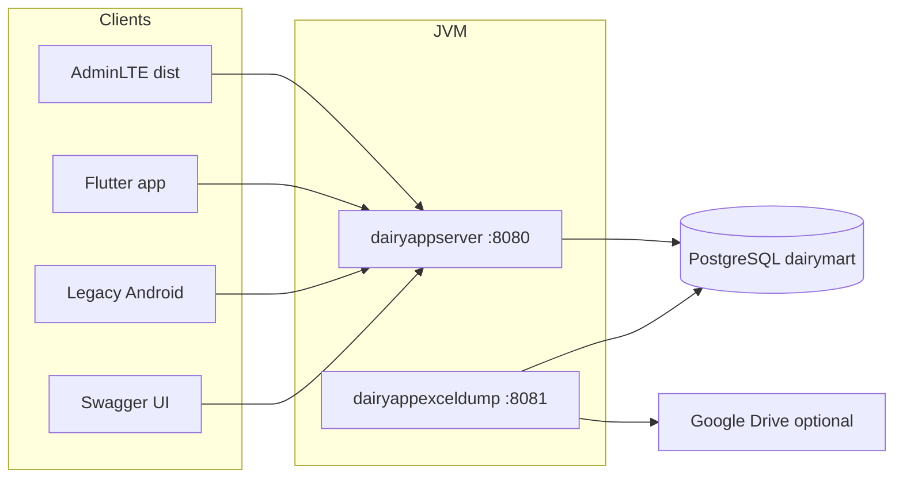

# Architecture

## System context



All product traffic goes through **dairyappserver**. The Excel dump process is a **second Spring Boot app**. It reads the same database; it does not call the API for table export.

## Repository layout

```
dairy-mart/
  dairyappserver/          Spring Boot 3.3, Java 17, JPA, Security
  AdminLTE/dist/           Static HTML/JS console (custom Dairy Mart pages)
  dairymartapp-flutter/    Flutter client
  dairymartapp/            Legacy Android (Volley)
  dairyappexceldump/       Spring Boot 3.5 + Spring Batch + POI
  docs/sql/                Incremental DDL (run as postgres, GRANT admin)
```

## Backend (`dairyappserver`)

- **Spring Web** controllers return JSON via **Gson**. Some error bodies are `{ "message": "..." }` (`ApiMessages`); older paths still return a Gson-encoded string. Clients unwrap both, including Gson wrappers `{ map }` and `{ myArrayList }`.
- **Spring Data JPA** maps to PostgreSQL. `ddl-auto` is **none**. Hibernate uses `PhysicalNamingStrategyStandardImpl` and `ImplicitNamingStrategyLegacyJpaImpl`, so `@Column(name = "...")` must match live lowercase column names.
- **Spring Security**: CSRF off, CORS on, HTTP Basic for most routes. Username is **phone number**. Passwords in the database are stored as Spring `{noop}...` (plain text with a noop encoder prefix). Login (`POST /auth/login`) is permitted without Basic; the body carries phone and password.
- **CORS** allows origin patterns for `localhost:*`, `127.0.0.1:*`, and `null` (file://), so AdminLTE on Live Server (typically 5500) can call port 8080.
- **OpenAPI / springdoc**: `/swagger-ui.html`, groups AdminLTE and Flutter apps. `/test` is hidden.

### Layering

```
controller  →  service  →  repository / JPA entity (dao)
                 ↓
               scheduler (daily ledger, excel file, scheduled notices)
```

Controllers are grouped by path prefix (`/admin`, `/retailorder`, `/crate`, `/inventory`, `/auth`, …). AdminLTE and the mobile apps share many of the same endpoints.

### Scheduled work on the API server

| Job | When | What |
| --- | --- | --- |
| `DailyLedgerScheduler` | `1 0 0 * * ?` | Snapshot wallets into `dailyledger` |
| `ExcelDumpScheduler` | same cron | Writes `DairyMartDump.xlsx` via `ExcelService` (working directory of the server process) |
| `ScheduledNotificationRelease` | every 30s | Releases due rows from `scheduled_notification` into `app_notification` |

## AdminLTE

Static site under `AdminLTE/dist`. `js/api.js` holds `dmApiBase()`, settings in `localStorage` key `dairymartSettings` (API URL, auto-refresh, live-map interval, default branch id). Layout is injected by `js/masterLayout.js` plus `components/header.js` and `components/sidebar.js`.

There is no AdminLTE build step required for Dairy Mart pages; edit files in `dist` and refresh the browser. Upstream AdminLTE sources live in `AdminLTE/src` and are not the Dairy Mart product UI.

## Mobile

Flutter is the supported client. It uses `http` plus Basic auth after login, session storage, and `DAIRYMART_API_BASE_URL`. The salesman app posts GPS to `/tracking/update`. Role routing: type **1** admin, **2** salesman, **3** retailer.

## Excel dump service (`dairyappexceldump`)

Independent Boot app:

1. Spring Batch job `dailyDataExportJob`: write workbook, then optional Drive upload.
2. Cron `0 59 23 * * ?` (23:59).
3. `POST /dump/run` to run immediately.
4. `spring.batch.job.enabled=false` so the job does not fire on every startup.
5. Missing optional tables are skipped. Passwords are never written.

Default HTTP port is **8080**. Run it on **8081** if `dairyappserver` is already using 8080.

## External systems

- **Twilio**: optional SMS (configured on the API). Leave unset or dummy in local if unused.
- **Google Drive**: dump module only; skipped when credentials or folder id are placeholders.
- **Maps**: AdminLTE live map uses Esri tiles (no Carto API key).
