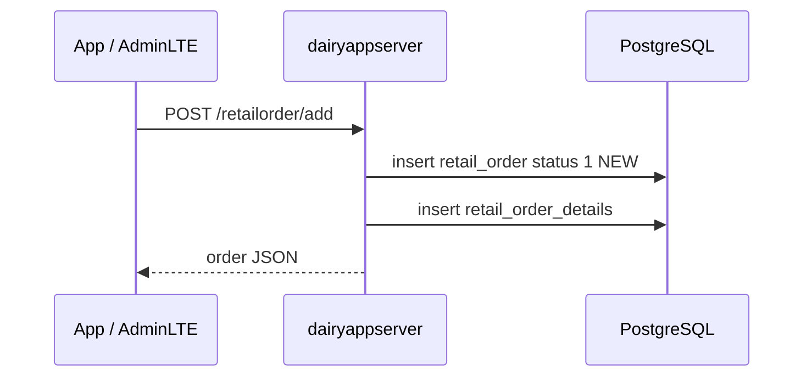
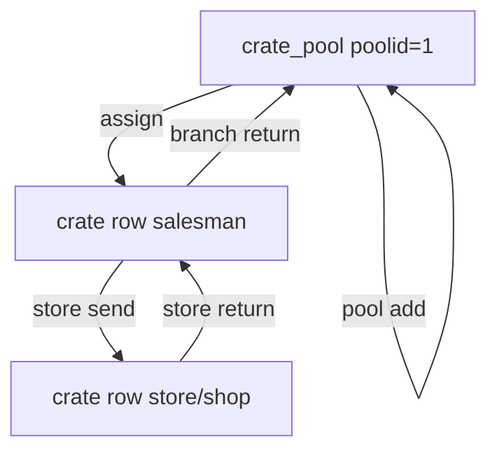

# Data flow

## Authentication and sessions

1. Client `POST /auth/login` with JSON `{ phoneNumber, password }` (no Basic header required).
2. Server matches `User.phonenumber` and password (after stripping `{noop}`).
3. Active `userlogin` rows for that phone/user are closed.
4. A new `userlogin` row is stored (`isactive`, `loggedin`). Role is `User.typeid` (1 admin, 2 salesman, 3 retailer).
5. Response includes user id, role, phone, and password for the client to build later **HTTP Basic** (`phone:password`).
6. `POST /auth/logout` marks the session inactive and sets `loggedout`.
7. AdminLTE **Online & logins** reads `GET /admin/sessions`.

## AdminLTE page load

1. Browser loads HTML from the static server.
2. `auth.js` sends Basic (or login page posts `/auth/login`).
3. Feature scripts call `dmApiFetch` in `api.js` (20s abort; banner if the API is unreachable).
4. JSON is unwrapped (Gson `map` / `myArrayList` and `{ message }`).

## Place an order (retailer or salesman)

- `retail_order.retailer_id` is the **shop id**, not the user id.
- If `branchId` is missing, the API defaults to **7** (same default as AdminLTE settings).
- Status starts at **1 NEW** unless the client sends another id.

## Confirm / dispatch / deliver and inventory

Stock lives in `branch_inventory` keyed by `(branchid, productid)`. Order lines identify products by **product code**. The service maps code → product id.

When an order **first** enters status **2 CONFIRMED**, **4 DISPATCHED**, or **5 DELIVERED**:

1. Required quantities are compared to on-hand (missing inventory row = 0).
2. Shortfall → HTTP 400 with `{ "message": "Not enough branch stock: ..." }`.
3. Otherwise quantities are deducted once for that order (not again if it later moves among 2/4/5).

AdminLTE inventory page (`GET/POST /inventory/...`) is the source of truth for on-hand counts. Salesman order views show availability versus the order’s branch.

Rejected (3), returned (6), and cancelled (7) do not consume stock on that path.

## Ledger and wallet

- Creating/updating orders and cash movements writes `ledger` / `ledgertransactions` and updates `userwallet`.
- Midnight job copies wallet/outstanding into `dailyledger` for that date.
- AdminLTE ledgers and salesman/retailer ledger screens read these tables through `/admin/ledgers`, `/ledger`, `/salesman/ledger`.

## Crates

- Pool is a single row (`docs/sql/create_crate_pool.sql`).
- Salesmen hold assigned crates; stores hold crates sent on a route.
- Retailers must not edit crate quantities in the product UI; movements go through salesman/admin APIs (`/crate/assign`, `/crate/store/send`, `/crate/store/return`, `/crate/branch/return`).
- `GET /crate/summary` powers AdminLTE crates and analytics crate locations.

## GPS and live map

1. Salesman Flutter posts `/tracking/update` (lat, lng, user, timestamp).
2. Rows land in `tracking`.
3. AdminLTE live map polls `/tracking/live` (latest ping per salesman). Trail for a day: `GET /tracking/get?userId=&date=dd-MM-yyyy`.
4. Settings `gpsStaleMinutes` controls how “stale” a marker looks in the UI; the API still returns the last ping.

## Notifications

| userId | Meaning |
| --- | --- |
| concrete user | Inbox item for that account (`GET /notification/get/{userId}`) |
| `0` | System/admin-wide notice (valid in this product) |
| `-1` | Platform **activity** feed (`GET /admin/activity`) |

- Immediate broadcast: `POST /notification/broadcast`.
- Future send: same body with `scheduledForMillis` → `scheduled_notification`; releaser every 30s copies to `app_notification` when due.
- Clients poll unread counts; mark read with `POST /notification/read/{id}`.

## Excel dumps (two paths)

**A. API process** (`ExcelDumpScheduler` / `GET /exceldump/generate` and `/exceldump/download`): writes `DairyMartDump.xlsx` next to the **server working directory**.

**B. Dump service**: Batch job builds a multi-sheet workbook (users without passwords, shops, products, orders, details, inventory, crates, pool, ledgers, transactions, wallets, notifications, scheduled notices, tracking, logins). Then Drive upload if configured. Trigger: 23:59 or `POST http://localhost:8081/dump/run`.

## Analytics

`GET /admin/analytics/get` aggregates orders (product/store mix), collections/payments, salesman collections, store×product, and crate holders. AdminLTE Analytics page is read-only.
